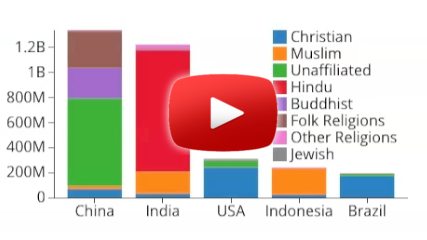

# Splitting Charts

 * [Video on YouTube: Splitting Charts](https://www.youtube.com/watch?v=6Xynj_pBybc&feature=youtu.be)
 * [Code Examples](http://curran.github.io/screencasts/splittingCharts/examples/viewer/#/)

This tutorial deals with the theme of "splitting charts", exploring how simple visualizations can be modified to support an additional dimension of data. Rectangles will be split into stacked bars, circles will be split into pies and donuts, and lines will be split apart.

Topics covered include:

 * stacked bar chart
 * grouped bar chart
 * pie chart
 * donut chart
 * line chart with multiple lines

Additional "goodies" that are covered include:

 * customizing a D3 number format to use "B" for billions
 * rotating tick mark labels to avoid overlap on the X axis
 * using [d3.layout.stack](https://github.com/mbostock/d3/wiki/Stack-Layout)

This tutorial assumes you already know the topics covered in [Introduction to D3](https://github.com/curran/screencasts/tree/gh-pages/introToD3).

## Data

The [data used in this tutorial](./datasets) begins with a single number, the current population of the World. This single number is conceptually split by country, religion, and time, deriving more complex data tables that require more complex visual presentations.

### Population

This is the kind of data you see if you [Google population of China](https://www.google.com/webhp?sourceid=chrome-instant&ion=1&espv=2&ie=UTF-8#q=population%20of%20china).

The following tables are derived from the [United Nations Population Division](http://esa.un.org/unpd/wpp/DVD/). The data has been preprocessed to extract population of the largest 5 countries for each year from 1950 to 2015, then transformed using this [preprocessing script](https://github.com/curran/data/blob/gh-pages/un/population/2015Extract/process.js)

 * [worldPopulation2015.csv](https://github.com/curran/screencasts/blob/gh-pages/splittingCharts/datasets/worldPopulation2015.csv)
 * [worldPopulationByYear.csv](https://github.com/curran/screencasts/blob/gh-pages/splittingCharts/datasets/worldPopulationByYear.csv)
 * [populationByCountry2015.csv](https://github.com/curran/screencasts/blob/gh-pages/splittingCharts/datasets/populationByCountry2015.csv)
 * [populationByCountryByYear.csv](https://github.com/curran/screencasts/blob/gh-pages/splittingCharts/datasets/populationByCountryByYear.csv)

### Religion

This data is shown in this [report on The Global Religious Landscape from Pew Research](http://www.pewforum.org/2012/12/18/global-religious-landscape-exec/). It is also shown in this [interactive visualization](http://www.globalreligiousfutures.org/explorer#/?subtopic=15&chartType=bar&year=2010&data_type=number&religious_affiliation=all&destination=to&countries=Worldwide&age_group=all&pdfMode=false).

The following tables are derived from the [Pew Research Center Global Religious Landscape data set](https://github.com/curran/data/tree/gh-pages/pew/religion), using this [processing script](https://github.com/curran/data/blob/gh-pages/pew/religion/processed/process.js):

 * [populationByCountry2010.csv](https://github.com/curran/screencasts/blob/gh-pages/splittingCharts/datasets/populationByCountry2010.csv)
 * [religionByCountryTop5.csv](https://github.com/curran/screencasts/blob/gh-pages/splittingCharts/datasets/religionByCountryTop5.csv)
 * [religionWorldTotals.csv](https://github.com/curran/screencasts/blob/gh-pages/splittingCharts/datasets/religionWorldTotals.csv)

Sketchy preprocessing disclaimer - the original data contained values "< 10000", which were converted to "0" in the preprocessing step so the data can be visualized.

## Examples

Check out the [Example Viewer](http://curran.github.io/screencasts/splittingCharts/examples/viewer/#/1). Use left and right arrow keys to navigate.

 * [Example 1](http://curran.github.io/screencasts/splittingCharts/examples/viewer/#/1) - ([run it!](http://curran.github.io/screencasts/splittingCharts/examples/code/snapshot01) | [index.html](http://curran.github.io/screencasts/splittingCharts/examples/viewer/#/1/index.html)) - Bar Chart
 * [Example 2](http://curran.github.io/screencasts/splittingCharts/examples/viewer/#/2) - ([run it!](http://curran.github.io/screencasts/splittingCharts/examples/code/snapshot02) | [index.html](http://curran.github.io/screencasts/splittingCharts/examples/viewer/#/2/index.html)) - Line Chart
 * [Example 3](http://curran.github.io/screencasts/splittingCharts/examples/viewer/#/3) - ([run it!](http://curran.github.io/screencasts/splittingCharts/examples/code/snapshot03) | [index.html](http://curran.github.io/screencasts/splittingCharts/examples/viewer/#/3/index.html)) - Scatter Plot
 * [Example 4](http://curran.github.io/screencasts/splittingCharts/examples/viewer/#/4) - ([run it!](http://curran.github.io/screencasts/splittingCharts/examples/code/snapshot04) | [index.html](http://curran.github.io/screencasts/splittingCharts/examples/viewer/#/4/index.html)) - World Population Single Bar
 * [Example 5](http://curran.github.io/screencasts/splittingCharts/examples/viewer/#/5) - ([run it!](http://curran.github.io/screencasts/splittingCharts/examples/code/snapshot05) | [index.html](http://curran.github.io/screencasts/splittingCharts/examples/viewer/#/5/index.html)) - Custom number format
 * [Example 6](http://curran.github.io/screencasts/splittingCharts/examples/viewer/#/6) - ([run it!](http://curran.github.io/screencasts/splittingCharts/examples/code/snapshot06) | [index.html](http://curran.github.io/screencasts/splittingCharts/examples/viewer/#/6/index.html)) - Top 5 countries
 * [Example 7](http://curran.github.io/screencasts/splittingCharts/examples/viewer/#/7) - ([run it!](http://curran.github.io/screencasts/splittingCharts/examples/code/snapshot07) | [index.html](http://curran.github.io/screencasts/splittingCharts/examples/viewer/#/7/index.html)) - Religions world totals
 * [Example 8](http://curran.github.io/screencasts/splittingCharts/examples/viewer/#/8) - ([run it!](http://curran.github.io/screencasts/splittingCharts/examples/code/snapshot08) | [index.html](http://curran.github.io/screencasts/splittingCharts/examples/viewer/#/8/index.html)) - Small tick labels
 * [Example 9](http://curran.github.io/screencasts/splittingCharts/examples/viewer/#/9) - ([run it!](http://curran.github.io/screencasts/splittingCharts/examples/code/snapshot09) | [index.html](http://curran.github.io/screencasts/splittingCharts/examples/viewer/#/9/index.html)) - Tilting tick labels
 * [Example 10](http://curran.github.io/screencasts/splittingCharts/examples/viewer/#/10) - ([run it!](http://curran.github.io/screencasts/splittingCharts/examples/code/snapshot10) | [index.html](http://curran.github.io/screencasts/splittingCharts/examples/viewer/#/10/index.html)) - Adding color
 * [Example 11](http://curran.github.io/screencasts/splittingCharts/examples/viewer/#/11) - ([run it!](http://curran.github.io/screencasts/splittingCharts/examples/code/snapshot11) | [index.html](http://curran.github.io/screencasts/splittingCharts/examples/viewer/#/11/index.html)) - Introducting Stack Layout
 * [Example 12](http://curran.github.io/screencasts/splittingCharts/examples/viewer/#/12) - ([run it!](http://curran.github.io/screencasts/splittingCharts/examples/code/snapshot12) | [index.html](http://curran.github.io/screencasts/splittingCharts/examples/viewer/#/12/index.html)) - Splitting a rectangle
 * [Example 13](http://curran.github.io/screencasts/splittingCharts/examples/viewer/#/13) - ([run it!](http://curran.github.io/screencasts/splittingCharts/examples/code/snapshot13) | [index.html](http://curran.github.io/screencasts/splittingCharts/examples/viewer/#/13/index.html)) - Adding another dimension
 * [Example 14](http://curran.github.io/screencasts/splittingCharts/examples/viewer/#/14) - ([run it!](http://curran.github.io/screencasts/splittingCharts/examples/code/snapshot14) | [index.html](http://curran.github.io/screencasts/splittingCharts/examples/viewer/#/14/index.html)) - Introducing d3.nest
 * [Example 15](http://curran.github.io/screencasts/splittingCharts/examples/viewer/#/15) - ([run it!](http://curran.github.io/screencasts/splittingCharts/examples/code/snapshot15) | [index.html](http://curran.github.io/screencasts/splittingCharts/examples/viewer/#/15/index.html)) - Nesting by religion
 * [Example 16](http://curran.github.io/screencasts/splittingCharts/examples/viewer/#/16) - ([run it!](http://curran.github.io/screencasts/splittingCharts/examples/code/snapshot16) | [index.html](http://curran.github.io/screencasts/splittingCharts/examples/viewer/#/16/index.html)) - nest & stack
 * [Example 17](http://curran.github.io/screencasts/splittingCharts/examples/viewer/#/17) - ([run it!](http://curran.github.io/screencasts/splittingCharts/examples/code/snapshot17) | [index.html](http://curran.github.io/screencasts/splittingCharts/examples/viewer/#/17/index.html)) - Stacked bars
 * [Example 18](http://curran.github.io/screencasts/splittingCharts/examples/viewer/#/18) - ([run it!](http://curran.github.io/screencasts/splittingCharts/examples/code/snapshot18) | [index.html](http://curran.github.io/screencasts/splittingCharts/examples/viewer/#/18/index.html)) - Adding a color legend
 * [Example 19](http://curran.github.io/screencasts/splittingCharts/examples/viewer/#/19) - ([run it!](http://curran.github.io/screencasts/splittingCharts/examples/code/snapshot19) | [index.html](http://curran.github.io/screencasts/splittingCharts/examples/viewer/#/19/index.html)) - Grouped bars
 * [Example 20](http://curran.github.io/screencasts/splittingCharts/examples/viewer/#/20) - ([run it!](http://curran.github.io/screencasts/splittingCharts/examples/code/snapshot20) | [index.html](http://curran.github.io/screencasts/splittingCharts/examples/viewer/#/20/index.html)) - Getting circular
 * [Example 21](http://curran.github.io/screencasts/splittingCharts/examples/viewer/#/21) - ([run it!](http://curran.github.io/screencasts/splittingCharts/examples/code/snapshot21) | [index.html](http://curran.github.io/screencasts/splittingCharts/examples/viewer/#/21/index.html)) - Circles for each country
 * [Example 22](http://curran.github.io/screencasts/splittingCharts/examples/viewer/#/22) - ([run it!](http://curran.github.io/screencasts/splittingCharts/examples/code/snapshot22) | [index.html](http://curran.github.io/screencasts/splittingCharts/examples/viewer/#/22/index.html)) - Circles for each religion
 * [Example 23](http://curran.github.io/screencasts/splittingCharts/examples/viewer/#/23) - ([run it!](http://curran.github.io/screencasts/splittingCharts/examples/code/snapshot23) | [index.html](http://curran.github.io/screencasts/splittingCharts/examples/viewer/#/23/index.html)) - Adding color
 * [Example 24](http://curran.github.io/screencasts/splittingCharts/examples/viewer/#/24) - ([run it!](http://curran.github.io/screencasts/splittingCharts/examples/code/snapshot24) | [index.html](http://curran.github.io/screencasts/splittingCharts/examples/viewer/#/24/index.html)) - Introducing Pie Layout
 * [Example 25](http://curran.github.io/screencasts/splittingCharts/examples/viewer/#/25) - ([run it!](http://curran.github.io/screencasts/splittingCharts/examples/code/snapshot25) | [index.html](http://curran.github.io/screencasts/splittingCharts/examples/viewer/#/25/index.html)) - Introducing d3.svg.arc
 * [Example 26](http://curran.github.io/screencasts/splittingCharts/examples/viewer/#/26) - ([run it!](http://curran.github.io/screencasts/splittingCharts/examples/code/snapshot26) | [index.html](http://curran.github.io/screencasts/splittingCharts/examples/viewer/#/26/index.html)) - Pie Chart
 * [Example 27](http://curran.github.io/screencasts/splittingCharts/examples/viewer/#/27) - ([run it!](http://curran.github.io/screencasts/splittingCharts/examples/code/snapshot27) | [index.html](http://curran.github.io/screencasts/splittingCharts/examples/viewer/#/27/index.html)) - Adding a color legend
 * [Example 28](http://curran.github.io/screencasts/splittingCharts/examples/viewer/#/28) - ([run it!](http://curran.github.io/screencasts/splittingCharts/examples/code/snapshot28) | [index.html](http://curran.github.io/screencasts/splittingCharts/examples/viewer/#/28/index.html)) - Donut Chart
 * [Example 29](http://curran.github.io/screencasts/splittingCharts/examples/viewer/#/29) - ([run it!](http://curran.github.io/screencasts/splittingCharts/examples/code/snapshot29) | [index.html](http://curran.github.io/screencasts/splittingCharts/examples/viewer/#/29/index.html)) - Polar area diagram
 * [Example 30](http://curran.github.io/screencasts/splittingCharts/examples/viewer/#/30) - ([run it!](http://curran.github.io/screencasts/splittingCharts/examples/code/snapshot30) | [index.html](http://curran.github.io/screencasts/splittingCharts/examples/viewer/#/30/index.html)) - Polar area multiples
 * [Example 31](http://curran.github.io/screencasts/splittingCharts/examples/viewer/#/31) - ([run it!](http://curran.github.io/screencasts/splittingCharts/examples/code/snapshot31) | [index.html](http://curran.github.io/screencasts/splittingCharts/examples/viewer/#/31/index.html)) - Donut multiples
 * [Example 32](http://curran.github.io/screencasts/splittingCharts/examples/viewer/#/32) - ([run it!](http://curran.github.io/screencasts/splittingCharts/examples/code/snapshot32) | [index.html](http://curran.github.io/screencasts/splittingCharts/examples/viewer/#/32/index.html)) - Pie multiples
 * [Example 33](http://curran.github.io/screencasts/splittingCharts/examples/viewer/#/33) - ([run it!](http://curran.github.io/screencasts/splittingCharts/examples/code/snapshot33) | [index.html](http://curran.github.io/screencasts/splittingCharts/examples/viewer/#/33/index.html)) - Sized pie multiples
 * [Example 34](http://curran.github.io/screencasts/splittingCharts/examples/viewer/#/34) - ([run it!](http://curran.github.io/screencasts/splittingCharts/examples/code/snapshot34) | [index.html](http://curran.github.io/screencasts/splittingCharts/examples/viewer/#/34/index.html)) - Line chart of current population
 * [Example 35](http://curran.github.io/screencasts/splittingCharts/examples/viewer/#/35) - ([run it!](http://curran.github.io/screencasts/splittingCharts/examples/code/snapshot35) | [index.html](http://curran.github.io/screencasts/splittingCharts/examples/viewer/#/35/index.html)) - Using the population extent
 * [Example 36](http://curran.github.io/screencasts/splittingCharts/examples/viewer/#/36) - ([run it!](http://curran.github.io/screencasts/splittingCharts/examples/code/snapshot36) | [index.html](http://curran.github.io/screencasts/splittingCharts/examples/viewer/#/36/index.html)) - Line chart of population
 * [Example 37](http://curran.github.io/screencasts/splittingCharts/examples/viewer/#/37) - ([run it!](http://curran.github.io/screencasts/splittingCharts/examples/code/snapshot37) | [index.html](http://curran.github.io/screencasts/splittingCharts/examples/viewer/#/37/index.html)) - Nesting timeseries by country
 * [Example 38](http://curran.github.io/screencasts/splittingCharts/examples/viewer/#/38) - ([run it!](http://curran.github.io/screencasts/splittingCharts/examples/code/snapshot38) | [index.html](http://curran.github.io/screencasts/splittingCharts/examples/viewer/#/38/index.html)) - Lines for each country
 * [Example 39](http://curran.github.io/screencasts/splittingCharts/examples/viewer/#/39) - ([run it!](http://curran.github.io/screencasts/splittingCharts/examples/code/snapshot39) | [index.html](http://curran.github.io/screencasts/splittingCharts/examples/viewer/#/39/index.html)) - Adding color
 * [Example 40](http://curran.github.io/screencasts/splittingCharts/examples/viewer/#/40) - ([run it!](http://curran.github.io/screencasts/splittingCharts/examples/code/snapshot40) | [index.html](http://curran.github.io/screencasts/splittingCharts/examples/viewer/#/40/index.html)) - Area chart of World population
 * [Example 41](http://curran.github.io/screencasts/splittingCharts/examples/viewer/#/41) - ([run it!](http://curran.github.io/screencasts/splittingCharts/examples/code/snapshot41) | [index.html](http://curran.github.io/screencasts/splittingCharts/examples/viewer/#/41/index.html)) - Stacked area chart
 * [Example 42](http://curran.github.io/screencasts/splittingCharts/examples/viewer/#/42) - ([run it!](http://curran.github.io/screencasts/splittingCharts/examples/code/snapshot42) | [index.html](http://curran.github.io/screencasts/splittingCharts/examples/viewer/#/42/index.html)) - Expanded stacked area chart

Feel free to use and modify this presentation framework for your own presentations! MIT License.

By [Curran Kelleher](https://github.com/curran/portfolio) October 2015
